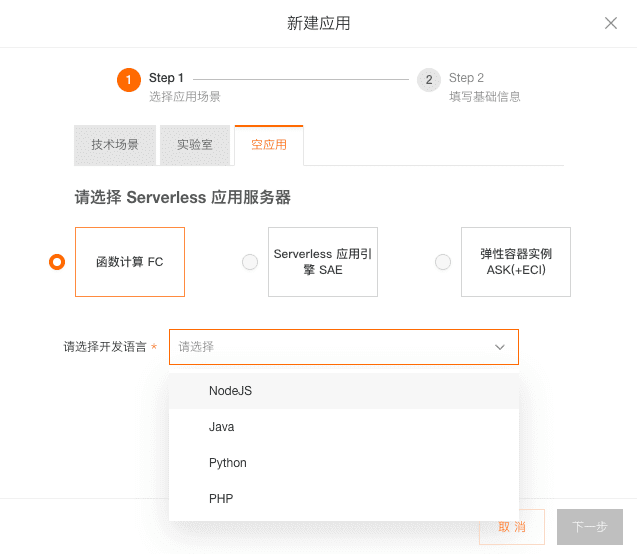
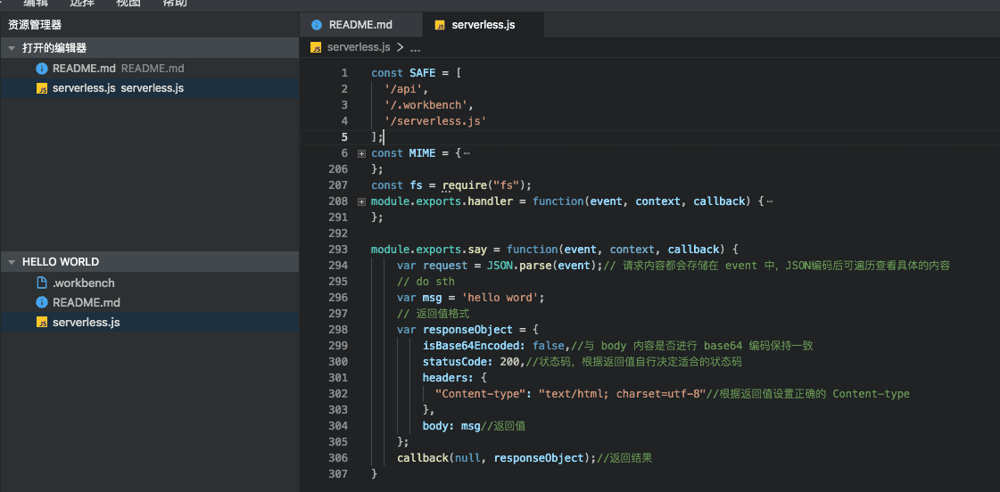

### 阿里云Serverless初体验：快速开发与部署一个Hello World （node 版本） 

​		今天被阿里云的10000人云上Hello World活动奖品吸引了，体验了一把Serverless（官方活动主页：https://developer.aliyun.com/topic/yiqi/hol?utm_content=g_1000180354）。

​		在Serverless 云上部署应用，接口返回`hello world`。

#### 一、进入云开发平台，选择应用列表，创建应用

#### 二、选择”空应用“ 标签

1. Serverless 应用服务器选择：”函数计算FC“
2. 开发语言选择：NodeJS

#### 三、填写应用信息

​		应用名称、应用介绍自己定义就行

#### 四、点击新建应用应用卡表中的”开发部署“按钮

#### 五、编写接口代码

​	1. 进入开发界面后，项目有三个文件，README.md 是项目创建说明文件。从这个文件可知简单创建一个api 的代码。并把代码拷贝到serverless.js 文件中去，并修改为` say` 函数，输入`hello world`

#### 六、编写路由地址（接口请求路径）

1. 选择部署测试菜单
2. 点击”添加一条路由“ 按钮
3. 配置路由（路径） 及 函数映射表（say函数映射）
4. 点击 ”保存到文件“，会把路由配置写到`.workbench`文件中
5. 点击 提交 按钮，把代码提交到仓库

#### 七、测试接口

1. 进去测试界面，进行接口测试
2. 选择”开发环境“
3. 填写测试路径： `/say`
4. 点击 ”测试“ 按钮
5. 在浏览器中访问 路径

开发很顺畅，以后要试试用Serverless 开发项目。

*参考链接*：

[1]. http://blog.didispace.com/aliyun-serverless-helloworld-202009/?spm=a2c6h.17666151.J_5899630810.1.45e96592KpSoKR Serverless Java版本

