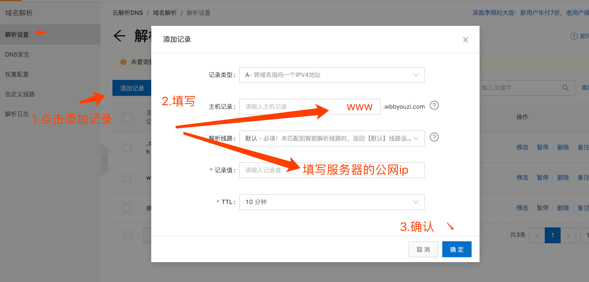
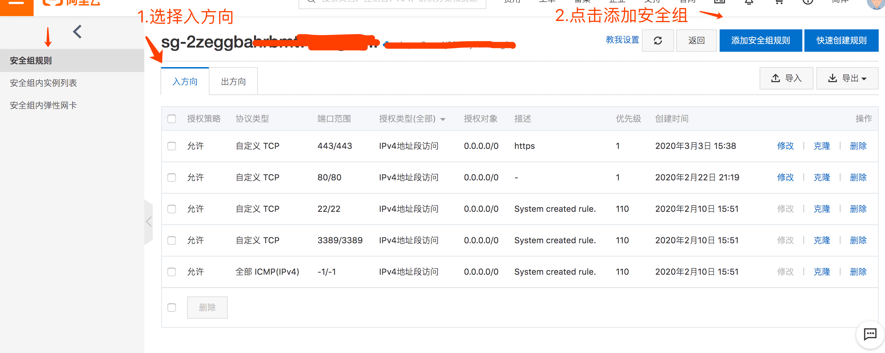
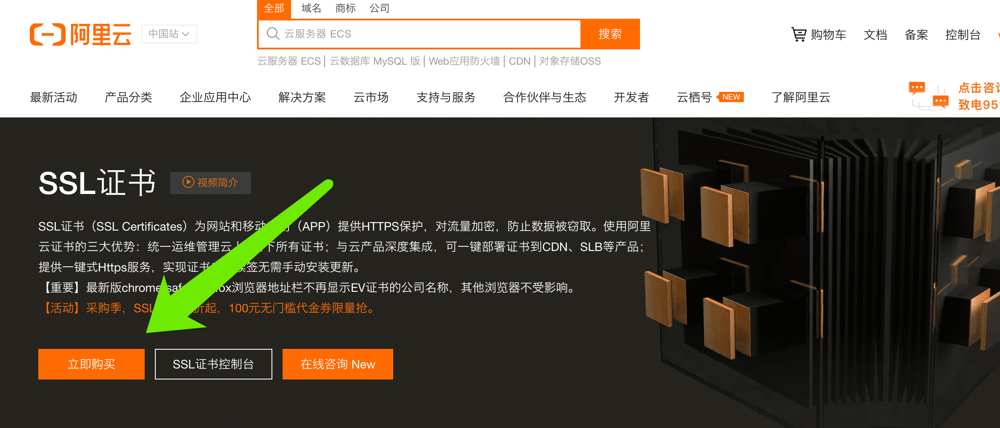
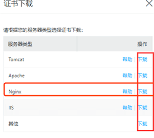

### 阿里云上搭建https网站全流程

> 过程简述：
>
> 1. 购买服务器
> 2. 购买域名
> 3. 申请备案
> 4. 域名解析
> 5. 搭建nginx服务器
> 6. 申请SSL证书
> 7. 配置nginx服务器

#### 1.购买服务器

阿里云上有两种适合个人的服务器，一种是ECS云服务器，另一种是云虚拟主机。

云虚拟主机相对ECS价格便宜、使用简单，但配置自由度差。ECS云服务器就相当于给了你一台电脑，至于电脑怎么配置，安装什么软件取决于你。博主喜欢折腾，购买的是ECS云服务器（本篇博客也是介绍ECS云服务器）。

 个人使用买个小配置即可，我购买的是新人1折优惠799￥-- 3年套餐（2核4G3M带宽共享计算型，感觉很划算有木有）。

> 新人1折优惠、有红包，阿里云推广链接
>
> https://www.aliyun.com/minisite/goods?source=5176.11533457&userCode=dlhor8t7&type=copy

#### 2.购买域名

为了域名、服务器管理方便，域名也在阿里云上购买。我买的是较便宜的`.com`域名 `wbbyouzi.com`，购买时需要实名认证。


#### 3.申请备案

备案也在阿里云上办，进入备案页面，填写个人网站备案信息，提交给阿里云初审，一般为一天左右审核时间，慢的话可以打客服咨询，会立马给你审核。

初审过了，阿里云会提交给工信部备案审核，预计20天左右，我的10天左右就审核下来了。


#### 4.域名解析

从登录账号->控制台->域名->解析进入，点击“添加记录”按钮，如下图：



> ECS服务器公网IP，从控制台->云服务器ECS->你购买的实例即可看到公网IP

#### 5.搭建nginx服务器

从nginx官网下载最新版本[nginx-1.16.1.tar.gz](http://nginx.org/en/download.html)，最好用最新版本，不然老版本编译的时候经常出错（深有体会）。搭建https服务是需要nginx安装**ssl模块**的，这点要注意。具体安装步骤如下：

1. 把安装包移到 `/usr/local`下

2. 解压安装包 `tar -zxvf nginx-1.16.1.tar.gz`

3. 进入安装包 `cd nginx-1.16.1`

4. 修改编译配置 

   `./configure --prefix=/usr/local/nginx --with-http_stub_status_module --with-http_ssl_module `

5. 编译 `make`

6. 安装 `make install` 即可

7. 验证 `nginx -v` 有以下代码即成功

   `configure arguments: --prefix=/usr/local/nginx --with-http_stub_status_module --with-http_ssl_module`

> `nginx -v`如提示无nginx 命令，需要在配置文件`/usr/local/nginx/conf/nginx.conf`的头部
>
> 添加`user root;` 即可
>
> 还不行的话就创建全局命令：
>
> `ln -s /usr/local/nginx/sbin/nginx /usr/bin/nginx` 
>
> 

接下来需要打开ECS服务器的80端口（http请求）和443端口（https请求），这个需要在控制台上去配置。

从控制台->云服务器ECS->网络与安全->安全组->点击“规则配置”，如图：


进入之后，选择安全组规则->入方向->添加安全组规则，配置80端口和443端口，如图：




#### 6.申请SSL证书

https服务是需要SSL证书的，阿里云上有个人免费的SSL证书。直接从阿里云产品中进入SSL证书产品页，点击购买，之后选择个人免费版一年，下单即可，如图：




进入控制台->SSL证书（应用安全），点击申请按钮，填写证书申请相关信息，提交等待ca机构审核。审核通过后，点击“验证”按钮，验证成功之后点击“下载”，下载nginx版本。如图：

1. 点击申请


2.填写证书申请信息


3.证书验证及下载




#### 7.配置nginx服务器

将证书上传到服务器上，在`/usr/local/nginx` 下新建cert文件夹，放进证书并解压。


配置nginx.conf 文件 `vim /usr/local/nginx/conf/nginx.conf` 如下：

```nginx
 server {
    listen       443 ssl;
    server_name  localhost;

    #SSL证书
    ssl_certificate      /usr/local/nginx/cert/3537186_wbbyouzi.com.pem;
    ssl_certificate_key  /usr/local/nginx/cert/3537186_wbbyouzi.com.key;

    keepalive_timeout   70;
    server_name wbbyouzi.com;
    charset utf-8;
    ssl_session_timeout 5m;
    ssl_ciphers ECDHE-RSA-AES128-GCM-SHA256:ECDHE:ECDH:AES:HIGH:!NULL:!aNULL:!MD5:!ADH:!RC4;
    ssl_protocols TLSv1 TLSv1.1 TLSv1.2;
    ssl_prefer_server_ciphers on;
    fastcgi_param   HTTPS               on;
    fastcgi_param   HTTP_SCHEME         https;

    location / {
      # 网站根目录
      root   /root/www;
      index  index.html index.htm;
    }
  }
  #http url 重定向到 https url
  server {
      listen       80;
      server_name wbbyouzi.com;
      return    301 https://$server_name$request_uri;
  }
    
```

配置完后启动nginx `nginx`，网站根目录放入一个简单网页测试, https://wbbyouzi.com。

**成功！！！**

