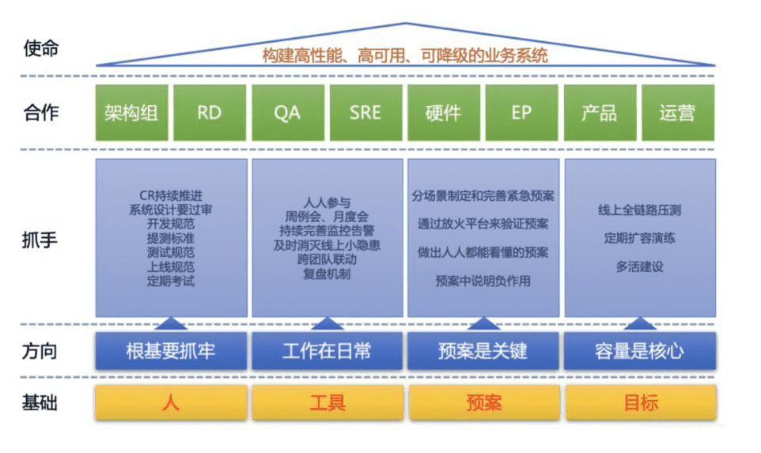

https://www.infoq.cn/article/z4ssmnks3w4ebbustyo1

### 2.故障源的分类

1. 人为因素
2. 自然因素

### 3.稳定性建设四要素

**稳定性建设四要素：人、工具、预案和目标**。

第一要素：人

- **谁应该参与稳定性建设？**
- **如何降低犯错的概率？**
- **如何提高稳定性意识？**
- **如何定责？**
- **如何激励？**

第二要素：工具

- **我们能做什么？**
- **我们能做到什么程度？**
- **如何降低稳定性工作成本？**

第三要素：预案

- **故障发生时我们该做什么？**
- **谁来指挥？**
- **谁来决策？**
- **我们如何善后？**

第四要素：目标

- **稳定性工作的价值是什么？**
- **稳定性工作如何考核？**

### 4. 稳定性建设四个方向

#### 第一个方向：根基要抓牢（45%）

**Code Review**

**设计评审**

**提测标准**

**测试流程**

**上线流程**

#### 第二个方向：工作在日常（30%）

**人人参与**

**持续完善监控告警**

**及时消灭线上小隐患**

**跨团队联动**

**复盘机制**

**会议机制**

#### 第三个方向：预案是关键（15%）

**分场景制定和完善紧急预案**

**通过放火平台来验证预案**

#### 第四个方向：容量是核心（10%）

