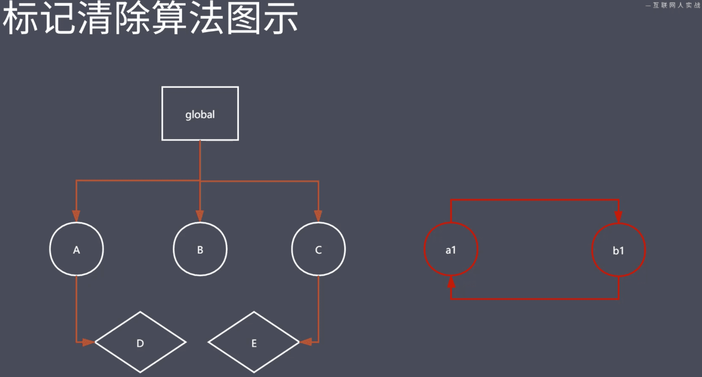
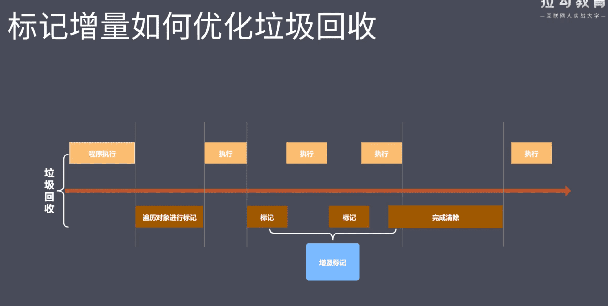
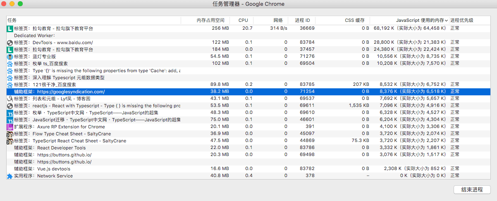

#### 1.课程概述

- 本阶段的核心是JavaScript语言的优化
- 内存管理
- 垃圾回收与常见GC算法
- V8引擎的垃圾回收
- Performance 工具
- 代码优化实例

#### 2.内存管理 Memory Management

- 内存：由可读写单元组成，标识一片可操作空间
- 管理：人为的去操作一片空间的申请、使用和释放
- 内存管理：开发者主动申请空间、使用空间、释放空间
- 管理流程：申请-使用-释放
- JavaScript 中的内存管理
  - 申请内存空间
  - 使用内存空间
  - 释放内存空间

```javascript
// 申请
let obj = {}

// 使用
obj.name = 'lg'

// 释放
obj = null
```

#### 3.JavaScript 中的垃圾回收

- JavaScript中内存管理是自动的
- 对象不再被应用时是垃圾
- 对象不能从根上访问到时是垃圾
- JavaScript中的可达对象
  - 可以访问到的对象就是可达对象（引用、作用域链）
  - 可达的标准就是从根出发是否能够被找到
  - JavaScript 中的根就可以理解为是全局变量对象

#### 4.GC算法介绍

- GC 就是垃圾回收机制的简写
- GC可以找到内存中的垃圾、并释放和回收空间
- GC里的垃圾是什么
  - 程序中不再需要使用的对象
  - 程序中不能再访问到的对象
- GC算法是什么
  - GC是一种机制，垃圾回收器完成具体的工作
  - 工作的内容就是查找垃圾释放空间、回收空间
  - 算法就是工作时查找和回收所遵循的规则
- 常见GC算法
  - 引用计数
  - 标记清除
  - 标记整理
  - 分代回收

#### 5.引用计数算法实现原理

- 核心思想：设置引用数，判断当前引用数是否为0 
- 引用计数器
- 引用关系改变时修改引用数字
- 引用数字为0时立即回收

#### 6.引用计数算法优缺点

- 优点
  - 发现垃圾时立即回收
  - 最大限度减少程序暂停
- 缺点
  - 无法回收循环引用的对象
  - 时间开销大

```javascript
// 循环引用对象无法回收
function fn(){
  const obj1 = {}
  const obj2 = {}
  obj1.name = obj2
  obj2.name = obj1
  return 'a'
}
fn()

```

#### 7.标记清除算法实现原理

- 核心思想：分标记和清楚二个阶段完成
- 遍历所有对象找标记活动对象
- 遍历所有对象清楚没有标记对象
- 回收响应的空间



#### 8.标记清除算法优缺点

- 空间碎片化


#### 9.标记整理算法实现原理

-  标记整理可以看做是标记清除的增强
- 标记阶段的操作和标记清除一致
- 清楚阶段会先执行整理，移动对象位置

#### 10.常见GC算法总结

- 引用计数
  - 可以即时回收垃圾对象
  - 减少程序卡顿时间
  - 无法回收循引用应用的对象
  - 资源消耗较大
- 标记清除
  - 可以回收循环引用的对象
  - 容易产生碎片化空间，浪费空间
  - 不会立即回收垃圾对象
- 标记整理
  - 减少碎片化空间
  - 不会立即回收垃圾对象
- 分代回收

#### 11.认识V8

- V8是一款主流的JavaScript 执行引擎
- V8采用即时编译
- V8内存设限  64位1.5G  32位 800M

#### 12.V8 垃圾回收策略

- 分代回收的思想
- 内存分为 新生代、老生代
- 针对不用对象采用不同算法
- V8 中常用GC算法
  - 分代回收
  - 空间复制
  - 标记清楚
  - 标记整理
  - 标记增量

#### 13.V8如何回收新生代对象

- V8 存储空间一分为二


- 小空间用于存储新生代对象（32M|16M）
- 新生代指的时存活时间较短的对象
- 新声代对象回收实现
  - 回收过程采用复制算法+标记整理
  - 新生代内存区分为二个等大小空间
  - 使用空间From，空闲空间为To
  - 活动对象存储于From 空间
  - 标记整理后将活动对象拷贝至To
  - From 与To交换空间完成释放
- 回收细节说明
  - 拷贝过程中可能出现晋升
  - 晋升就是将新生代对象移动至老生代
  - 一轮GC还存活的新生代需要晋升
  - To空间的使用率超过25%

#### 14.V8如何回收老生代对象

- 老生代对象存放在右侧老生代区域
- 64 位 1.4G 32位 700M
- 老生代对象就是指存活时间较长的对象
- 老生代对象回收实现
  - 主要采用标记清除、标记整理、增量标记算法
  - 首先使用标记清除完成垃圾空间的回收
  - 采用标记整理进行空间优化
  - 采用增量标记进行效率优化
- 细节对比
  - 新生代区域垃圾回收使用空间换时间  
  - 老生代区域垃圾回收不适合复制算法
  - 标记增量 类似 Yielding Proccess



#### 15.V8垃圾回收总结

- V8是一款主流的JavaScript执行引擎
- V8内存设置上限
  - 浏览器决定
  - GC垃圾回收决定，如果内存太大GC垃圾回收时间过长，影响用户体验
  - V8采用基于分代回收思想实现垃圾回收
  - V8 内存分为新生代和老生代
  - V8垃圾回收常见GC算法

#### 16.Performance工具介绍

- 为什么使用Performance
  - GC的目的是为了实现内存空间的良性循环
  - 良性新循环的基石是合理使用
  - 时刻关注才能确定是否合理
  - Performance 提供多种监控方式
- 通过Performance 时刻监控内存
- Performance 使用步骤
  - 打开浏览器输入目标网址
  - 进入开发人员工具面板，选择性能
  - 开启录制功能，访问具体界面
  - 执行用户行为，一段时间后停止录制
  - 分析界面中记录的内存信息

#### 17.内存问题的提现

- 页面出现延迟加载或经常性暂停
- 页面持续性出现糟糕的性能
- 页面的性能随时间延长越来越差

#### 18.监控内存的几种方式

- 界定内存问题的标准
  - 内存泄露：内存使用持续升高
  - 内存膨胀：在多数设备上都存在性能问题
  - 频繁垃圾回收：通过内存变化图进行分析
- 监控内存的几种方式
  - 浏览器任务管理器
  - Timeline时序图记录
  - 推快照查找分离DOM
  - 判断是否存在频繁的垃圾回收

#### 19.任务管理器监控内存

- JavaScript 使用的内存



#### 20.Timeline 记录内存

#### 21.推快照查找分离DOM

- 什么是分离DOM
  - 界面元素存活在DOM树上
  - 垃圾对象时的DOM节点
  - 分离状态的DOM节点
- Deta 查找分离Dom
- memory

### 22.判断是否存在频繁GC

- 为什么确定频繁垃圾回收
  - GC工作时应用程序是停止的
  - 频繁且过长的GC会导致引用假死
  - 用户使用中感知应用卡顿
- 确定频繁的垃圾回收
  - Timeline 中频繁的上升下降
  - 任务管理器中数据频繁的增加减小

#### 23.Performance 总结

- Performance 使用流程
- 内存问题的相关分析
- Performance 时序图监控内存变化
- 任务管理器监控内存变化
- 堆快照查找分离DOM

#### 24.代码优化介绍

- 本质上就是采集大量的执行样本进行数据统计和分析
- 使用基于Benchmark.js 的 `https://jsperf.com` 完成
- Jsperf 使用流程
  - 使用GitHub 账号登录
  - 填写个人信息（非必须）
  - 填写详细的测试用例信息（title、slug）
  - 填写准备代码（DOM操作时经常使用）
  - 填写必须要有setup 与 teardown 代码
  - 填写测试代码片段

#### 25.慎用全局变量

- 全局变量定义在全局执行上下文，是所有作用域链的顶端
- 全局执行上下文一直存在于上下文执行栈，直到程序退出
- 如果某个局部作用域出现了同名变量则会遮蔽或污染全局

#### 26.缓存全局变量

- 如缓存Document 对象

#### 27.通过原型对象添加附加方法

```javascript
var fn1 = function (arams) {
  this.foo=function(){
    console.log(11111)
  }
}
let f1 = new fn1()

var fn2 = function(){}

fn2.prototype.foo = function(){
  console.log(11111)
}
let f2 = new fn2()
```

#### 28.避开闭包陷阱

- 闭包特点
  - 外部具有指向内部的引用
  - 在“外”不作用域访问“内”部作用域的数据
- 关于闭包
  - 闭包是一种强大的语法
  - 闭包使用不当很容易出现内存泄露
  - 不要为了闭包而闭包
  - Dom 元素要及时释放

#### 29.避免属性访问方法使用

- JS 不需属性的访问方法，所有属性都是外部可见的
- 使用属性访问方法只会增加一层重定义，没有访问的控制力

```javascript
//慢
function Person(){
  this.name = 'icoder'
  this.age = 18
  this.getAge = function(){
    return this.age
  }
}
const p1 = new Person()
const a = p1.getAge()

//快
function Person1() {
  this.name = 'icoder'
  this.age = 18
} 

const p2 = new Person()
const b = p2.age
```

#### 30.For循环优化

```javascript
for(let i=0; len=10; i<len;i++){
  console.log(i)
}
```

#### 31.选择最优的循环方法

```javascript
var arrList = new Array(1,2,3,4,5)
// 最快
arrList.forEach((item)=>{
  console.log(item)
})
// 二快
for(var i=arrList.length;i;i--){
  console.log(arrList[i])
}
// 最慢
for(var i in arrList){
  console.log(arrList[i])
}
```

#### 32.文档碎片优化节点添加

```javascript
document.createDocumentFragment()
```

#### 33.克隆优化节点操作

- 克隆已存在Dom 节点，复制进行插入操作

#### 34.直接量替换new Object

```
//速度快
let a = [1,2,3]
//速度慢
let b = new Array(3)
b[0] = 1
b[1] = 2
b[2] = 3 

```


