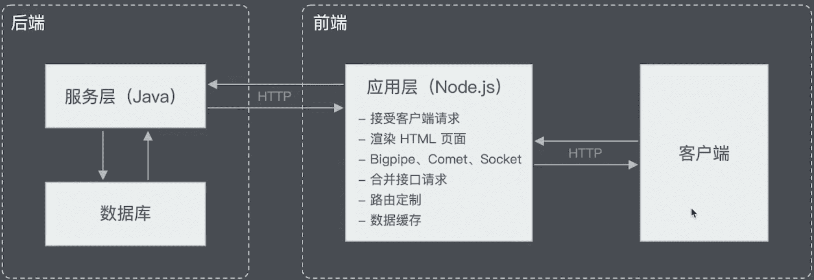
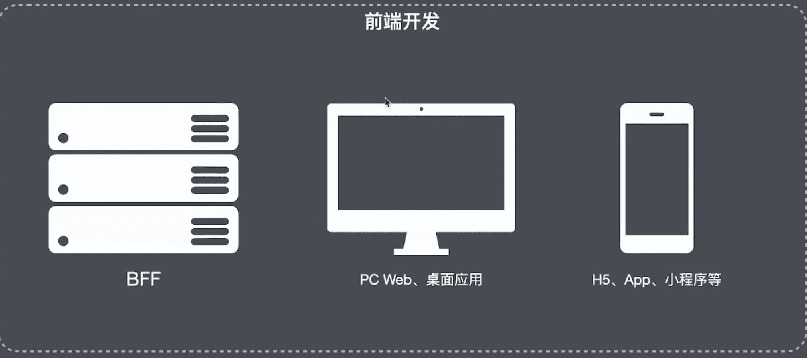

### 大前端

#### 服务于前端的后端  BFF Backend for Frontend 

BFF可使用场景：多端应用、服务聚合、非必要

BFF实战玩法：

- 访问控制

  例如，服务中的权限控制，将所有服务中的权限控制集中在 BFF 层，使下层服务更加纯粹和独立。

- 应用缓存

  项目中时常存在一些需要缓存的临时数据，此时 BFF 作为业务的汇聚点，距离用户请求最近，遂将该缓存操作放在 BFF 层。

- 第三方入口

  在业务中需要与第三方交互时，将该交互放在BFF，这样可以只暴露必要信息给第三方，从而便于控制第三方的访问

#### 大前端由来

- 大前端包括
  - BFF（中间层）开发
  - 泛客户端开发
  - 传统Web技术的深入