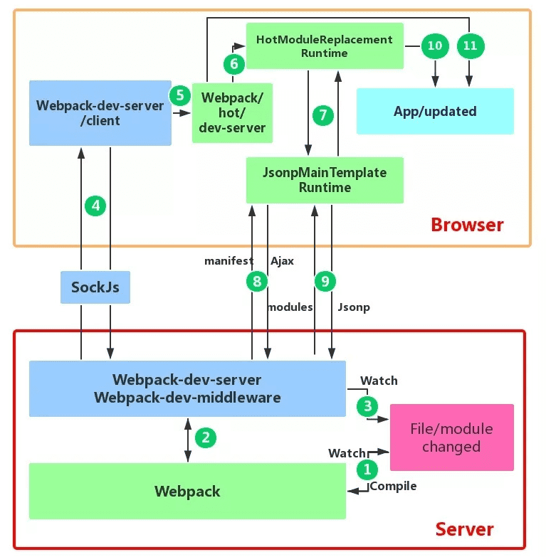

#### 1.webpack 热更新原理，是如何做到在不刷新浏览器的前提下更新页面

1. 当修改了一个或多个文件；
2. 文件系统接收更改并通知webpack；
3. webpack重新编译构建一个或多个模块，并通知HMR服务器进行更新；
4. HMR Server 使用webSocket通知HMR runtime 需要更新，HMR运行时通过HTTP请求更新jsonp；
5. HMR运行时替换更新中的模块，如果确定这些模块无法更新，则触发整个页面刷新；



首先要知道server端和client端都做了处理工作

1. 第一步，在 webpack 的 watch 模式下，文件系统中某一个文件发生修改，webpack 监听到文件变化，根据配置文件对模块重新编译打包，并将打包后的代码通过简单的 JavaScript 对象保存在内存中。
2. 第二步是 webpack-dev-server 和 webpack 之间的接口交互，而在这一步，主要是 dev-server 的中间件 webpack-dev-middleware 和 webpack 之间的交互，webpack-dev-middleware 调用 webpack 暴露的 API对代码变化进行监控，并且告诉 webpack，将代码打包到内存中。
3. 第三步是 webpack-dev-server 对文件变化的一个监控，这一步不同于第一步，并不是监控代码变化重新打包。当我们在配置文件中配置了devServer.watchContentBase 为 true 的时候，Server 会监听这些配置文件夹中静态文件的变化，变化后会通知浏览器端对应用进行 live reload。注意，这儿是浏览器刷新，和 HMR 是两个概念。
4. 第四步也是 webpack-dev-server 代码的工作，该步骤主要是通过 sockjs（webpack-dev-server 的依赖）在浏览器端和服务端之间建立一个 websocket 长连接，将 webpack 编译打包的各个阶段的状态信息告知浏览器端，同时也包括第三步中 Server 监听静态文件变化的信息。浏览器端根据这些 socket 消息进行不同的操作。当然服务端传递的最主要信息还是新模块的 hash 值，后面的步骤根据这一 hash 值来进行模块热替换。
5. webpack-dev-server/client 端并不能够请求更新的代码，也不会执行热更模块操作，而把这些工作又交回给了 webpack，webpack/hot/dev-server 的工作就是根据 webpack-dev-server/client 传给它的信息以及 dev-server 的配置决定是刷新浏览器呢还是进行模块热更新。当然如果仅仅是刷新浏览器，也就没有后面那些步骤了。
6. HotModuleReplacement.runtime 是客户端 HMR 的中枢，它接收到上一步传递给他的新模块的 hash 值，它通过 JsonpMainTemplate.runtime 向 server 端发送 Ajax 请求，服务端返回一个 json，该 json 包含了所有要更新的模块的 hash 值，获取到更新列表后，该模块再次通过 jsonp 请求，获取到最新的模块代码。这就是上图中 7、8、9 步骤。
7. 而第 10 步是决定 HMR 成功与否的关键步骤，在该步骤中，HotModulePlugin 将会对新旧模块进行对比，决定是否更新模块，在决定更新模块后，检查模块之间的依赖关系，更新模块的同时更新模块间的依赖引用。
8. 最后一步，当 HMR 失败后，回退到 live reload 操作，也就是进行浏览器刷新来获取最新打包代码

#### 2.webpack中loader 和plugin的区别

webpack中loader和plugin这两个概念如何区分。

对于loader，它就是一个转换器，将A文件进行编译形成B文件，这里操作的是文件，比如将A.scss或A.less转变为B.css，单纯的文件转换过程；

对于plugin，它就是一个扩展器，它丰富了wepack本身，针对是loader结束后，webpack打包的整个过程，它并不直接操作文件，而是基于事件机制工作，会监听webpack打包过程中的某些节点，例如

`Loader` 本质就是一个函数，在该函数中对接收到的内容进行转换，返回转换后的结果。 因为 Webpack 只认识 JavaScript，所以 Loader 就成了翻译官，对其他类型的资源进行转译的预处理工作。

`Plugin` 就是插件，基于事件流框架 `Tapable`，插件可以扩展 Webpack 的功能，在 Webpack 运行的生命周期中会广播出许多事件，Plugin 可以监听这些事件，在合适的时机通过 Webpack 提供的 API 改变输出结果。

`Loader` 在 module.rules 中配置，作为模块的解析规则，类型为数组。每一项都是一个 Object，内部包含了 test(类型文件)、loader、options (参数)等属性。

`Plugin` 在 plugins 中单独配置，类型为数组，每一项是一个 Plugin 的实例，参数都通过构造函数传入。

run：开始编译
make：从entry开始递归分析依赖并对依赖进行build
build-moodule：使用loader加载文件并build模块
normal-module-loader：对loader加载的文件用acorn编译，生成抽象语法树AST
program：开始对AST进行遍历，当遇到require时触发call require事件
seal：所有依赖build完成，开始对chunk进行优化（抽取公共模块、加hash等）
optimize-chunk-assets：压缩代码
emit：把各个chunk输出到结果文件
通过对节点的监听，从而找到合适的节点对文件做适当的处理。

#### 3.Webpack 性能优化

##### 1.优化loader

对于Loader，影响打包效率的是它的属性Babel.Babel会将代码转为字符串 生成AST，然后对AST继续进行转变最后生成新的代码，项目越大，转换代码越多，效率就越低。

优化Loader 的文件搜索范围

```tsx
module.exports = {
        module:{
            rules:[
              {
                //js文件才使用babel
                test:/\.js$/,
                loader:'babel-loader',
                //只在src文件夹下查找
                include:[resolve('src')]，
                //不会去查找的路径
                exclude:/node_modules/
              }
            ]
        }
    }
```

##### 2.把Babel编译过的文件缓存起来

```bash
loader: 'babel-loader?cacheDirectory=ture'
```

##### 3.HappyPack

因为Node是单线程运行的，所以Webpack在打包的过程中也是单线程的，特别是在执行Loader的时候，这样会导致等待的情况
HappyPack可以将Loader的同步执行转换为并行的

```tsx
module:{
        loader:[
           {
                //js文件才使用babel
                test:/\.js$/,
                //只在src文件夹下查找
                include:[resolve('src')]，
                exclude:/node_modules/,
                //id后面的内容对应下面
                loader:'happypack/loader?id=happypack'
           }
        ]
    },
    plugins:[
      new HappyPack({
        id:'happypack',
        loaders:['babel-loader?cacheDirectory'],
        //开启4个线程
        threads:4
      })
    ]
```

##### 4.DllPlugin

DllPlugin可以将特定的类库提前打包然后引入。这种方式可以极大的减少打包类库的次数，只有当类库更新版本才有需要重新打包，并且也实现了将公共代码抽离成单独文件的优化方案

```jsx
//单独配置在一个文件里
    //webpack.dll.conf.js
    const path = require('path')
    const webpack = require('webpack')
    module.exports = {
        entry:{
            //想统一打包的库
            vendor:['react']
        },
        output:{
            path:path.join(__dirname,'dist'),
            filename:'[name].dll.js',
            library:'[name]-[hash]'
        },
        plugins:[
          new webpack.DllPlugin({
            //name必须和output.library一致
            name:'[name]-[hash]',
            //该属性需要与DllReferencePlugin中一致
            context:__dirname,
            path:path.join(__dirname,'dist','[name]-mainfest.json')
          })
        ]
    }
```

然后需要执行这个配置文件生成依赖文件，接下来需要使用DllReferencePluhin将依赖文件引入项目中

```jsx
//webpack.conf.js
   module.exports={
    //...省略其他配置
    plugins: [
      new webpack.DllReferencePlugin({
        context: __dirname,
        mainfest:require('./dist/vendor-mainfest.json')
      })
    ]
   }
```

##### 5.按需加载

如果我们把十几个页面甚至更多的路由页面，把这些页面全部打包进一个JS文件的话，虽然将多个请求合并了，但是同样也加载了很多并不需要的代码，耗费了更长的时间。那么为了首页能更快地呈现给客户，这时候我们就可以使用按需加载，将每个路由页面单独打包为一个文件，当然不仅路由可以按需加载，对于loadash这种大型类库可以使用这个功能

```jsx
当使用的时候再去下载对应文件，返回一个Promise当Promise成功以后去执行回调
```

##### 6.Scope Hoisting

Scope Hoisting会分析出模块之间的依赖关系，尽可能的把打包出来的模块合并到一个函数中去。

```tsx
比如我们希望打包两个模块
   //test.js
   export const a=1
   //index.js
   import {a} from './test.js'
   对于这种情况，我们打包出来的代码类似这样
   [
     function (module,exports,require){
        //...
     },
     function(module,exports,require){
        //...
     }

   ]
   但是如果我们使用Scope Hoisting的话，代码就会尽可能的合并到一个函数去，也就变成了这样的类似代码
   [
     function(module,exports,require){
        //...
     }
   ]
   这样的打包方式生成的代码明显比之前的少了多了。如果在webpack4中希望开启这个功能，只需要启用
   optimization.concatenateModules就可以了
   module,exports={
    optimization:{
        concatenateModules:true
    }
   }
```

#####  7.Tree Shaking

Tree Shaking 可以实现删除项目中未被引用的代码

```jsx
 //test.js
   export const a = 1;
   export const b = 2;
   //index.js
   import {a} from './test.js'
```

#### 8.如何提高webpack的构建速度？

1. 多入口情况下，使用CommonsChunkPlugin来提取公共代码
2. 通过externals配置来提取常用库
3. 利用DllPlugin和DllReferencePlugin预编译资源模块 通过DllPlugin来对那些我们引用但是绝对不会修改的npm包来进行预编译，再通过DllReferencePlugin将预编译的模块加载进来。
4. 使用Happypack 实现多线程加速编译
5. 使用webpack-uglify-parallel来提升uglifyPlugin的压缩速度。 原理上webpack-uglify-parallel采用了多核并行压缩来提升压缩速度
6. 使用Tree-shaking和Scope Hoisting来剔除多余代码

#### 9.有哪些常见的Loader？他们是解决什么问题的？

- file-loader：把文件输出到一个文件夹中，在代码中通过相对 URL 去引用输出的文件
- url-loader：和 file-loader 类似，但是能在文件很小的情况下以 base64 的方式把文件内容注入到代码中去
- source-map-loader：加载额外的 Source Map 文件，以方便断点调试
- image-loader：加载并且压缩图片文件
- babel-loader：把 ES6 转换成 ES5
- css-loader：加载 CSS，支持模块化、压缩、文件导入等特性
- style-loader：把 CSS 代码注入到 JavaScript 中，通过 DOM 操作去加载 CSS。
- eslint-loader：通过 ESLint 检查 JavaScript 代码

#### 10.哪些常见的Plugin？他们是解决什么问题的？

- define-plugin：定义环境变量
- commons-chunk-plugin：提取公共代码
- uglifyjs-webpack-plugin：通过UglifyES压缩ES6代码

#### 11.webpack-dev-server和http服务器如nginx有什么区别?

webpack-dev-server使用内存来存储webpack开发环境下的打包文件，并且可以使用模块热更新，他比传统的http服务对开发更加简单高效。