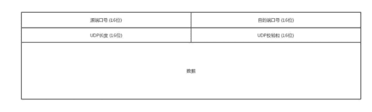
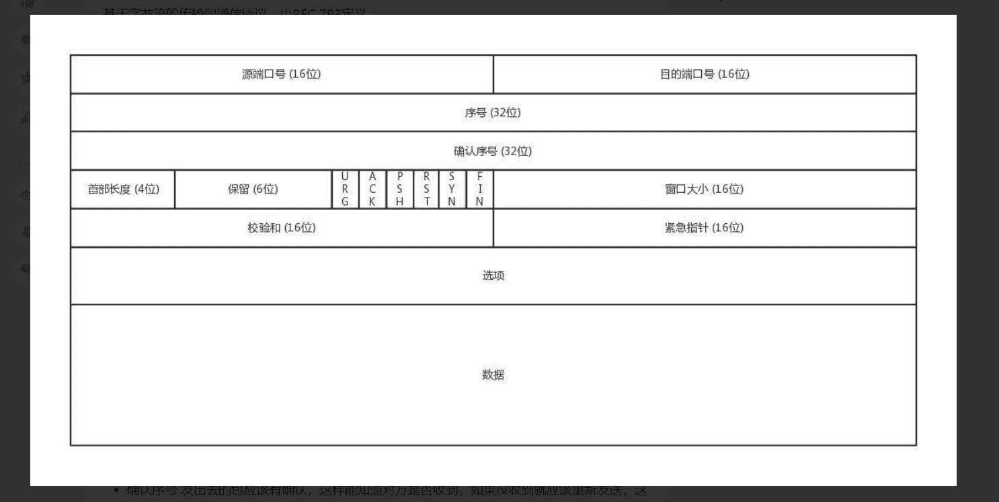

#### 1.谈谈你对TCP 三次握手和四次挥手的理解

#### 2.http2 与 http1 的区别

1. 二进制协议

HTTP/1.1 版的头信息肯定是文本（ASCII编码），数据体可以是文本，也可以是二进制。HTTP/2 则是一个彻底的二进制协议，头信息和数据体都是二进制，并且统称为"帧"（frame）：头信息帧和数据帧。

> 二进制协议的一个好处是，可以定义额外的帧。HTTP/2 定义了近十种帧，为将来的高级应用打好了基础。如果使用文本实现这种功能，解析数据将会变得非常麻烦，二进制解析则方便得多。

2. 头信息压缩

   HTTP 协议不带有状态，每次请求都必须附上所有信息。HTTP/2 对这一点做了优化，引入了头信息压缩机制（header compression）。一方面，头信息使用`gzip`或`compress`压缩后再发送；另一方面，客户端和服务器同时维护一张头信息表，所有字段都会存入这个表，生成一个索引号，以后就不发送同样字段了，只发送索引号，这样就提高速度了。

3. 数据流

   因为 HTTP/2 的数据包是不按顺序发送的，同一个连接里面连续的数据包，可能属于不同的回应。

   > HTTP/2 复用TCP连接，在一个连接里，客户端和浏览器都可以同时发送多个请求或回应，而且不用按照顺序一一对应，这样就避免了"队头堵塞"。

4. 可双向通讯

   HTTP/2 允许服务器未经请求，主动向客户端发送资源

#### 3.A、B 机器正常连接后，B 机器突然重启，问A 此时处于TCP 什么状态

如果A 与B 建立了正常连接后，从未相互发过数据，这个时候B 突然机器重
启，问A 此时处于TCP 什么状态？如何消除服务器程序中的这个状态？

#### 4.TCP 与 UDP 协议的区别？

##### UDP

UDP（User Datagram Protocol） 全称是用户数据电报协议，是一种无连接的协议，提供不可靠的用户数据报服务。

UDP 协议头中只包含 4 个字段：源端口、目的端口、UDP长度、UDP校验码，其中每一个字段都占 16 位，即 2 字节，共8个字节。

1. 面向无连接 UDP 不需要与 TCP一样在发送数据前进行三次握手建立连接，UDP想发数据就直接发送了；并且UDP只是数据报文的搬运工，不会对数据报文进行任何拆分和拼接操作。
2. 不可靠 首先不可靠性体现在无连接上，通信都不需要建立连接，想发就发，这样的情况肯定不可靠的；并且收到什么数据就传递什么数据，也不会备份数据，发送数据也不会关心对方是否已经正确接收到数据； 再者网络环境时好时坏，但是 UDP 因为没有拥塞控制，一直会以恒定的速度发送数据；即使网络条件不好，也不会对发送速率进行调整，这样实现的弊端就是在网络条件不好的情况下可能会导致丢包，但是优点也很明显，在某些实时性要求高的场景（比如直播、电话会议等）就需要使用 UDP 而不是 TCP；
3. 单播、多播、广播功能。 由于 UDP 不会建立连接，因此它可以给任何人传递数据，不止支持一对一的传输方式，同样支持一对多、多对多、多对一的方式；
4. UDP是面向报文的 发送方的UDP对应用程序交下来的报文，在添加首部后就向下交付IP层（UDP对应用层交下来的报文，既不合并，也不拆分，而是保留这些报文的边界）；
5. 头部开销小，传输数据高效 UDP 的头部开销小，只有八字节，在传输数据报文时是比较高效的（在某些实时性要求高的场景，例如直播、电话会议、媒体传输等场景经常使用 UDP协议）；

##### TCP

TCP（Transmission Control Protocol）协议全称是传输控制协议，是一种面向连接的、可靠的、基于字节流的传输层通信协议。

1. 源端口、目标端口 发送方进程的端口号，数据接收方的端口号（范围0-65535）；

2. 序号 主要是为了解决乱序问题（编好号才知道哪个先来，哪个后到）；

3. **确认序号 发出去的包应该有确认，这样能知道对方是否收到，如果没收到就应该重新发送，这个解决的是不丢包的问题；**

4. 状态位 SYN 是发起一个链接，ACK 是回复，RST 是重新连接，FIN 是结束连接（TCP 是面向连接的，因此需要双方维护连接的状态，这些状态位的包会引起双方的状态变更）；

5. 窗口大小 TCP 要做流量控制，需要通信双方各声明一个窗口，标识自己当前的处理能力

#### **5.回答这个问题之前，要考虑TCP协议为什么会丢包，在什么样的情况下会丢包。**

A服务器发送数据给B服务器频率过高时，B服务器来不及处理，造成数据丢包。

(原因可能是程序逻辑问题，多线程同步问题，缓冲区溢出问题)

如果A服务器不对发送频率进行控制，或者数据进行重发的话，那么B服务器收到数据就会少。就会造成丢失数据

#### **6.TCP协议丢包后，如何解决丢包的问题**

为了满足TCP协议不丢包。TCP协议有如下规定：

1. 数据分片：发送端对数据进行分片，接受端要对数据进行重组，由TCP确定分片的大小并控制分片和重组

2. 到达确认：接收端接收到分片数据时，根据分片数据序号向发送端发送一个确认

3. 超时重发：发送方在发送分片时设置超时定时器，如果在定时器超时之后没有收到相应的确认，重发分片数据

4. 滑动窗口：TCP连接的每一方的接受缓冲空间大小固定，接收端只允许另一端发送接收端缓冲区所能接纳的数据，TCP在滑动窗口的基础上提供流量控制，防止较快主机致使较慢主机的缓冲区溢出

5. 失序处理：作为IP数据报来传输的TCP分片到达时可能会失序，TCP将对收到的数据进行重新排序，将收到的数据以正确的顺序交给应用层;

6. 重复处理：作为IP数据报来传输的TCP分片会发生重复，TCP的接收端必须丢弃重复的数据;

7. 数据校验：TCP将保持它首部和数据的检验和，这是一个端到端的检验和，目的是检测数据在传输过程中的任何变化。如果收到分片的检验或有差错，TCP将丢弃这个分片，并不确认收到此报文段导致对端超时并重发

#### 7.你所知道的http的响应码及含义？

1xx(临时响应)

100: 请求者应当继续提出请求。

101(切换协议) 请求者已要求服务器切换协议，服务器已确认并准备进行切换。

2xx(成功)

200：正确的请求返回正确的结果

201：表示资源被正确的创建。比如说，我们 POST 用户名、密码正确创建了一个用户就可以返回 201。

202：请求是正确的，但是结果正在处理中，这时候客户端可以通过轮询等机制继续请求。

3xx(已重定向)

300：请求成功，但结果有多种选择。

301：请求成功，但是资源被永久转移。

303：使用 GET 来访问新的地址来获取资源。

304：请求的资源并没有被修改过

4xx(请求错误)

400：请求出现错误，比如请求头不对等。

401：没有提供认证信息。请求的时候没有带上 Token 等。

402：为以后需要所保留的状态码。

403：请求的资源不允许访问。就是说没有权限。

404：请求的内容不存在。

5xx(服务器错误)

500：服务器错误。

501：请求还没有被实现。