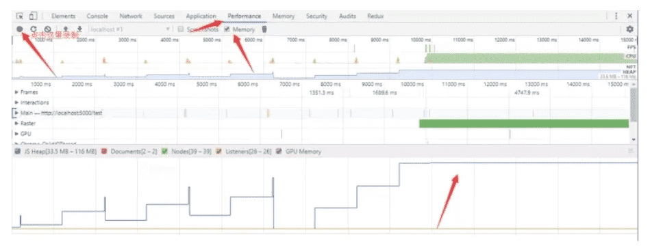
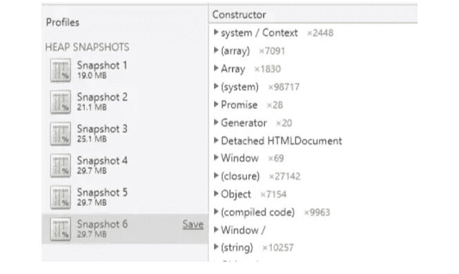
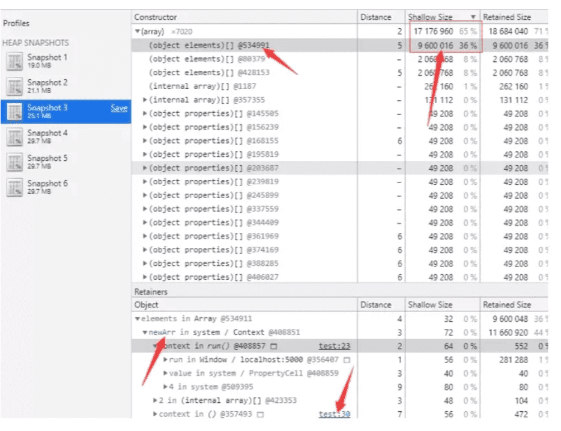

#### 1.介绍下npm 模块安装机制，为什么输入npm install就可以自动安装对应的模块？

#### 2.HTML5 的离线存储怎么使用，工作原理能不能解释下?

HTML5的离线存储是**基于**一个新建的**.appcache文件的缓存机制(**不是存储技术)，通过这个文件上的解析清单离线存储资源；

```
<html lang="en" manifest="cache.manifest">
// 服务器需要配置相应的mime-type 字段
```

manifest文件，基本格式为三段： CACHE， NETWORK（可选），与 FALLBACK（可选）

如何更新缓存：

1. 更新manifest文件
2. 通过javascript操作
3. 清除浏览器缓存

#### 3.onload 和 DomContentLoaded 的区别

DomContentLoaded  Dom树构建完毕执行，onload 页面载入完毕执行

#### 4.元素节点类型？ 判断当前节点类型？

1. 元素节点
2. 属性节点
3. 文本节点
4. 注释节点
5. 文档节点

通过`nodeObject.nodeType` 判断节点类型

<<<<<<< HEAD
#### 


=======
#### 5.内存泄露的发现与查找位置
>>>>>>> a74bfb975d1c261c0338cb6f77ebdea6067c9007

#####   确认是否泄露问题

1. 打开谷歌开发者工具，切换至 **Performance** 选项，勾选 `Memory` 选项。

2. 

   我们可以使用内存走势图判断当前页面是否有内存泄漏

#####  查找内存泄漏出现的位置

打开谷歌开发者工具，切换至 **Memory** 选项。页面上点击运行按钮，然后点击开发者工具左上角录制按钮，录制完成后继续点击录制，知道录制完三个为止。然后点击页面的停止按钮，再连续录制 3 次内存（不要清理之前的录制）。下图就是进行这些步骤后的截图：



然后第二步的主要目的来了，记录 JavaScript 堆内存才是内存录制的主要目的，我们可以看到哪个堆占用的内存更高。

在刚才的录制中选择 Snapshot 3 ，然后按照 **Shallow Size** 进行逆序排序（不了解的可以看[内存术语](https://developers.google.com/web/tools/chrome-devtools/memory-problems/memory-101?hl=zh-cn)）



从内存记录中，发现 array 对象占用最大，展开后发现，第一个 `object elements` 占用最大，选择这个 `object elements` 后可以在下面看到 `newArr` 变量，然后点击 `test:23`，只要是高亮下划线的地方都可以进去看看 （测试页面是 test.html），可以跳转到 `newArr` 附近。